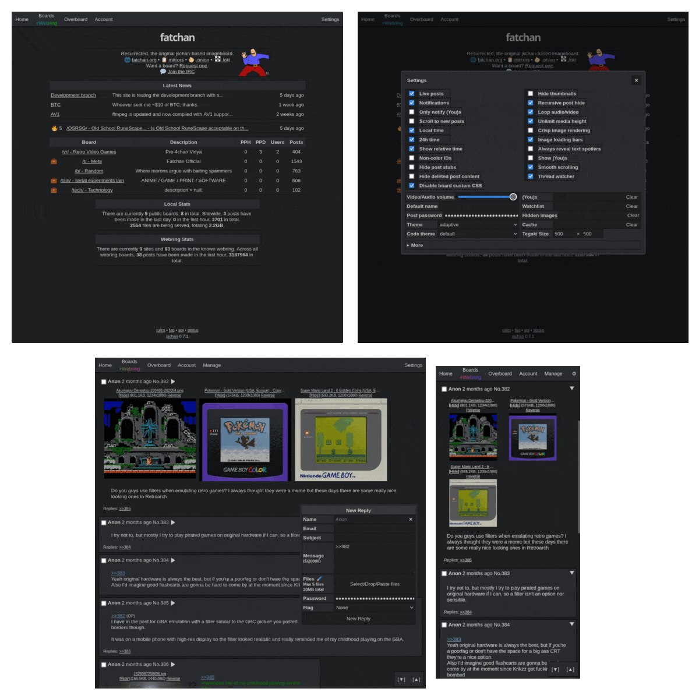

# jschan

Anonymous imageboard software that doesn't suck. Deployed on railway :)

Mirror(s):
 - #TODO

Live instances (Unofficial):
 - 🏴‍☠️ https://boards.archetype.blue

## Features
 - [x] Multiple language support (🇬🇧 🇵🇹 🇧🇷 🇷🇺 🇮🇹 🇪🇸)
 - [x] Optional user created boards
 - [x] Multiple files per post
 - [x] Antispam/Anti-flood & DNSBL
 - [x] 3 customisable inbuilt captchas + 3 third party captchas (hcaptcha, recaptcha, yandex smartcaptcha)
 - [x] Two factor authentication (TOTP) for accounts
 - [x] Manage everything from the web panel
 - [x] Granular account permissions
 - [x] Works properly with anonymizer networks (Tor, Lokinet, etc)
 - [x] Web3 integration - register, login, and sign posts with [MetaMask](https://metamask.io)
 - [x] [Tegaki](https://github.com/desuwa/tegaki) applet with drawing and replays
 - [x] [API documentation](https://fatchan.gitgud.site/jschan-docs/)
 - [x] Built-in webring (compatible w/ [lynxchan](https://gitlab.com/alogware/LynxChanAddon-Webring) & [infinity](https://gitlab.com/Tenicu/infinityaddon-webring))
 - [x] Beautiful bundled frontend with lots of themes and options, see below:

## License
GNU AGPLv3, see [LICENSE](LICENSE).

## Installation & Upgrading
See [INSTALLATION.md](INSTALLATION.md) for instructions on setting up a jschan instance or upgrading to a newer version.

## Changelog
See [CHANGELOG.md](CHANGELOG.md) for changes between versions.

## Contributing
See [CONTRIBUTING.md](CONTRIBUTING.md) for contribution guidelines.

## Related Projects

Official:
 - [fatchan/jschan-docs](https://gitgud.io/fatchan/jschan-docs/) - API Documentation for jschan ([gitgud pages](https://fatchan.gitgud.site/jschan-docs/#introduction))
 - [fatchan/jschan-api-go](https://gitgud.io/fatchan/jschan-api-go) - WIP Golang API Client for jschan ([gitgud pages](https://fatchan.gitgud.site/jschan-api-go/pkg/jschan/))
 - [jschan-antispam group](https://gitgud.io/jschan-antispam/) - Multiple projects that are compatible with jschan and implement more sophisticated antispam capabilities.

Unofficial: **Not guaranteed to work or be safe, use at your own risk.**
 - [globalafk](https://git.ptchan.org/globalafk/) - "A simple python script that sends ugly notifications when something happens on a jschan imageboard that you moderate."
 - [reporter](https://git.ptchan.org/reporter/) - news bot that fetches news from a provider and posts a snippet of it on a configurable board of a configurable jschan imageboard
 - [yacam](https://git.ptchan.org/yacam/) - a bot that tries to detect (dumb) spam on jschan imageboards and does something about it

## Credits
  - [fatchan](https://gitgud.io/fatchan/jschan) - Original Developer & Repo
